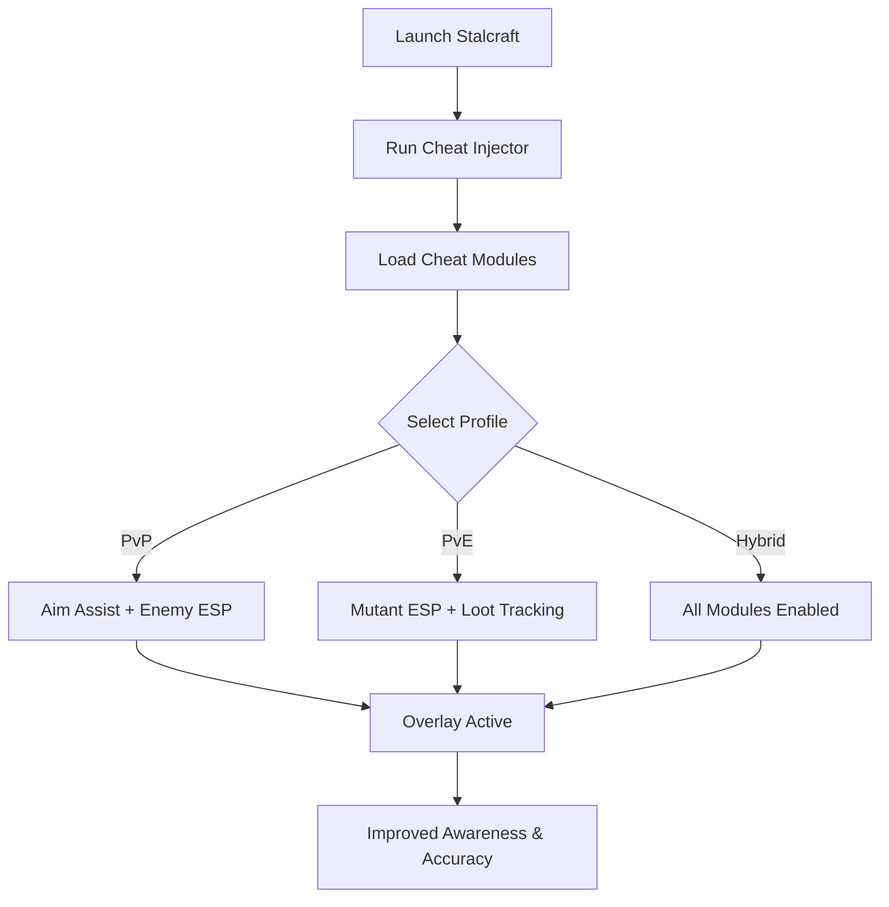

# Stalcraft Cheat Tool ☢️

**Stalcraft** combines survival mechanics with MMO shooter chaos—radiation zones, mutant threats, and PvP firefights all collide in the same world. To stay alive, you need more than just skill: you need awareness. The **Stalcraft Cheat Tool** provides **ESP overlays, aim assist, and loot tracking**, designed for players who want an edge in every zone.

---

## 🌐 Overview

Unlike basic hacks, this tool is **modular and customizable**. Switch between PvE survival profiles and PvP combat builds with hotkeys. Highlight enemies, track valuable loot, or stabilize recoil in firefights—all with a lightweight overlay optimized for Windows PCs.

---

## 🔑 Features

* 👁 **ESP Overlay** – Track enemies, allies, mutants, and loot through terrain.
* 🎯 **Aim Assist** – Configurable FOV, smoothness, and bone targeting.
* 💎 **Loot ESP** – Highlight rare gear, stashes, and quest items.
* ☢️ **Mutant ESP** – Spot hostile mutants in dark or radiated zones.
* ⚡ **Recoil Manager** – Reduces weapon kick for tighter groupings.
* 🗂 **Profile Manager** – Save configs for PvE, PvP, or hybrid play.
* ⌨️ **Hotkey Switching** – Instantly enable/disable modules.
* 🔒 **Stealth Injection** – Lightweight loader with minimized detection.

---

[](#)
[](#)
[](#)
[](#)

---

## 🖥 Compatibility

| Platform       | Status        | Notes                          |
| -------------- | ------------- | ------------------------------ |
| Windows 10     | ✅ Supported   | Stable injection builds        |
| Windows 11     | ✅ Optimized   | Smoothest ESP rendering        |
| Linux (Proton) | ⚠️ Partial    | ESP functional, assist limited |
| macOS          | ❌ Unsupported | VM-only workaround             |

\[!NOTE]
The cheat tool is **best optimized for Windows with DirectX rendering**.

---

## ⚙️ Setup Guide

1. Download the Stalcraft Cheat package.

2. Extract files into a secure folder.

3. Launch Stalcraft.

4. Run injector as administrator:

   ```bash
   stalcraft_cheat.exe -game stalcraft.exe -mode stealth
   ```

5. Configure `config.ini`:

   ```ini
   [AimAssist]
   FOV=85
   Smoothness=6
   Target=Chest
   Hotkey=Mouse4

   [ESP]
   Enemies=True
   Allies=True
   Mutants=True
   Loot=True
   EnemyColor=Red
   AllyColor=Blue
   LootColor=Yellow
   MutantColor=Purple
   ```

6. Toggle overlay with `Insert`.

\[!IMPORTANT]
Inject only **after the game fully loads** to ensure stability.

---

## 📊 Cheat Workflow



---

## 🎚 Example Configurations

**PvP Profile:**

```ini
Enemies=True
Smoothness=7
FOV=90
Target=Head
```

**PvE Profile:**

```ini
Mutants=True
Loot=True
Enemies=False
```

**Hybrid Profile:**

```ini
Enemies=True
Mutants=True
Loot=True
Allies=True
```

\[!WARNING]
Activating all ESP layers at once may overcrowd the screen—focus configs are better.

---

## ❓ FAQ

**Q: Does the cheat lower FPS?**
A: No, it’s lightweight with <3% performance impact.

**Q: Can I switch configs mid-session?**
A: Yes, hotkeys allow instant switching.

**Q: Does it work with controllers?**
A: Partial support; mouse/keyboard is optimal.

**Q: Do updates follow Stalcraft patches?**
A: Yes, the tool updates alongside patch cycles.

**Q: Is stealth injection 100% safe?**
A: It reduces detection risk but is never fully undetectable.

---

## 🚀 Final Thoughts

The **Stalcraft Cheat Tool** merges **ESP overlays, aim assist, and loot/mutant tracking** into one adaptive package. Whether fighting mutants in PvE or clashing with stalkers in PvP, it ensures better survival, accuracy, and loot efficiency.

[](#)
[](#)
[](#)

---

